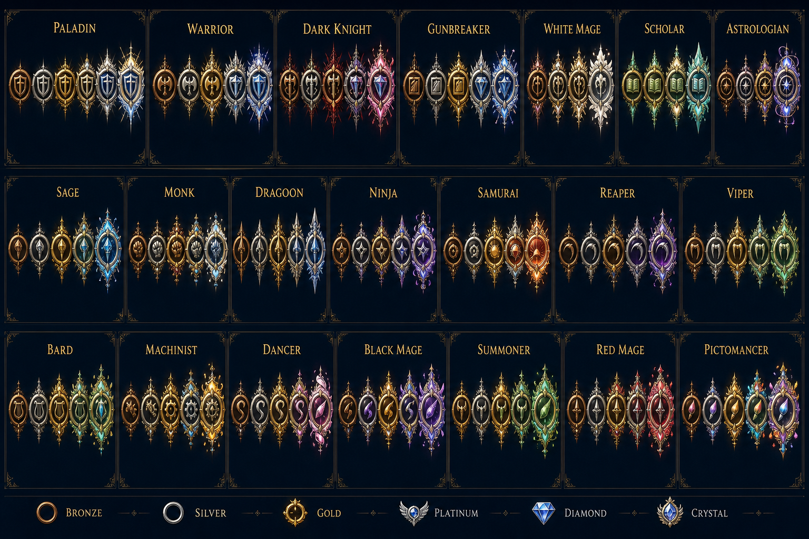

# Crystal Job Rank

Repository: https://github.com/kittenhaswares-ui/CrystalJobRank

Crystal Job Rank is an experimental Dalamud plugin for **post-match**
Crystalline Conflict statistics. It records the result screen, keeps a local
match history, and calculates a separate community-style rating for every job
you play.

Version 0.4.1 connects the optional community leaderboard to the live hosted
API at `https://crystal-job-rank-api.kittenhaswares.workers.dev`. Fresh
installs use that address automatically. Existing installations that still
contain the old placeholder address migrate once; custom server addresses,
leaderboard credentials, and sharing choices are preserved. Registration and
future match sharing remain separate opt-ins. Temporary upload failures stay in
a bounded local FIFO queue and retry automatically without writing API keys or
scoreboard rows to that queue.

Version 0.4 adds official in-game job icons with rank-metal colors and
job-specific ornaments, persistent personal records, and role achievements.
The update starts every local job at a fresh 1500 rating exactly once. Match
history, all-time peaks, personal scoreboard records, and badges are retained.

The rating is not Square Enix's hidden matchmaking rating and it is not an
official competitive ladder. It is a transparent, outcome-only estimate:

- every job starts at 1500;
- Casual and Ranked wins add rating, while Casual and Ranked losses remove it;
- Custom and Unknown-queue matches are recorded but never rated or uploaded;
- the first 10 matches use a larger provisional adjustment (`K = 64`),
  followed by a steadier established adjustment (`K = 32`);
- damage, kills, and healing are displayed but never influence rating.

Each job card also keeps its all-time highest rating and highest local kills,
damage dealt, damage taken, and healing. Scoreboard records include every
locally recorded CC match; only Casual and Ranked affect rating and streaks.

The header displays two achievement families for Tank, DPS, and Healer. Job
changes within the same role continue that role's sequence, while playing a
different role neither advances nor breaks it:

- **Flawless** — finish 1, 3, 5, 10, or 20 eligible matches in a row without dying;
- **Win Streak** — win 3, 5, 10, or 20 eligible matches in a row.

Custom and Unknown-queue matches do not count and do not interrupt a streak.
The highest badge remains unlocked after the active streak ends.

The rating screen uses job-colored progress bars and six visual tiers. The
initial 1500 rating starts at Bronze, followed by Silver at 1600, Gold at
1700, Platinum at 1800, Diamond at 1900, and Crystal at 2000. Ratings below
1500 remain Bronze. The colors follow the familiar
community/FFLogs job palette; Square Enix does not publish an official set of
job-color hex values.

The center of every rank badge is the official job icon loaded at runtime from
the player's FFXIV installation. The plugin does not redistribute those game
textures. Bronze through Crystal tint the icon and add progressively richer
frames; job motifs include Dark Knight lightning, Bard music notes, Dancer
feathers, and equivalent ornaments for every supported job.



The concept board was generated with OpenAI image generation for art direction.
The shipping UI deliberately uses Square Enix's real in-game icons rather than
AI-redrawn substitutes.

The rating is a fixed-reference logistic estimate because FFXIV does not expose
opponent MMR. At equilibrium, the visible thresholds correspond to roughly
50.0%, 52.9%, 55.7%, 58.6%, 61.3%, and 64.0% estimated win probability against
the reference pool. This keeps the ladder attainable without pretending to
know the strength of a particular lobby.

This repository also contains the opt-in community leaderboard API. A shared
leaderboard cannot work from a static GitHub repository alone: it needs a
common service that receives submissions. The reference service runs on a
Cloudflare Worker with an EU-jurisdiction D1 database; creating an alias and
enabling future match sharing are separate choices in the plugin. Raw arena,
duration, and local scoreboard values are validated but not retained by the
hosted database. Its production API base URL is
`https://crystal-job-rank-api.kittenhaswares.workers.dev`, with a public
[health check](https://crystal-job-rank-api.kittenhaswares.workers.dev/health).
Other players' names and IDs never leave the PC. See
[`PRIVACY.md`](PRIVACY.md) for the complete data flow, public fields, retention,
and deletion behavior. D1 constraints cap costly late-result replays, daily
registrations, and per-job submission volume so the free shared service has
authoritative abuse bounds beyond its edge rate limits.

## Status

Early MVP. The domain model and server can be tested without FFXIV. The Dalamud
capture hook must be verified in game after every FFXIV patch because its
signature and packet layout can change.

## Repository layout

- `src/CrystalJobRank.Core` — deterministic rating engine and shared contracts.
- `src/CrystalJobRank.Plugin` — Dalamud API 15 plugin.
- `src/CrystalJobRank.Worker` — hosted Cloudflare Worker/D1 leaderboard API.
- `src/CrystalJobRank.Server` — local/self-hosted ASP.NET development API.
- `tests/CrystalJobRank.Core.SelfTest` — dependency-free rating and persistence checks.
- `docs/ARCHITECTURE.md` — privacy, trust, and deployment decisions.

## Build

Requirements: .NET 10 SDK. Building the plugin also restores
`Dalamud.NET.Sdk/15.0.0`.

```powershell
dotnet build CrystalJobRank.slnx -c Release
dotnet run --project tests/CrystalJobRank.Core.SelfTest -c Release
```

Run the development server:

```powershell
dotnet run --project src/CrystalJobRank.Server
```

The API listens on the URL printed by ASP.NET Core. Configure that HTTPS URL in
the plugin before opting in to leaderboard sharing.

The production Worker uses pnpm 11 and Cloudflare's local workerd/D1 runtime:

```powershell
cd src/CrystalJobRank.Worker
pnpm install
pnpm check
pnpm test
pnpm db:migrate:local
```

Deployment and EU-database creation are documented in
[`src/CrystalJobRank.Worker/README.md`](src/CrystalJobRank.Worker/README.md).

## Dalamud development install

Build `src/CrystalJobRank.Plugin`, add the resulting
`CrystalJobRank.Plugin.dll` as a development plugin in Dalamud, then use
`/cjr`. The plugin records only the post-match results payload; it does not
render live combat information or automate gameplay.

## Install from the custom repository

Add this URL under Dalamud Settings > Experimental > Custom Plugin
Repositories:

```text
https://raw.githubusercontent.com/kittenhaswares-ui/CrystalJobRank/main/repo.json
```

Save the settings, open `/xlplugins`, search for **Crystal Job Rank**, and
install it. Use `/cjr` to open the plugin window and its leaderboard settings.

Local rating commands:

```text
/cjr reset SGE
/cjr reset DRK
/cjr reset all
```

Job abbreviations are case-insensitive and use the official three-letter job
codes. A reset starts a new local rating epoch at 1500 Bronze while preserving
the complete match history. It intentionally does not erase the shared
community leaderboard, where freely deleting losses would undermine the
ladder.

The 0.4 update also performs one automatic season reset for every job. This is
schema-migration based and therefore cannot repeat on later launches. A hosted
copy of the included leaderboard server likewise moves existing submissions to
historical season 0 and starts season 1 once when upgraded.

## Distribution caveat

Dalamud's official repository currently rejects PvP plugins that could create a
competitive advantage. This project intentionally avoids live assistance, but
official acceptance is still unlikely and must be discussed with the Plugin
Approval Committee before submission. A custom repository is the realistic
distribution path.

## License and attribution

Crystal Job Rank is released under the MIT License. Research for the current
post-match result layout was cross-checked against the MIT-licensed PvP Tracker
project. See `THIRD_PARTY_NOTICES.md`.
